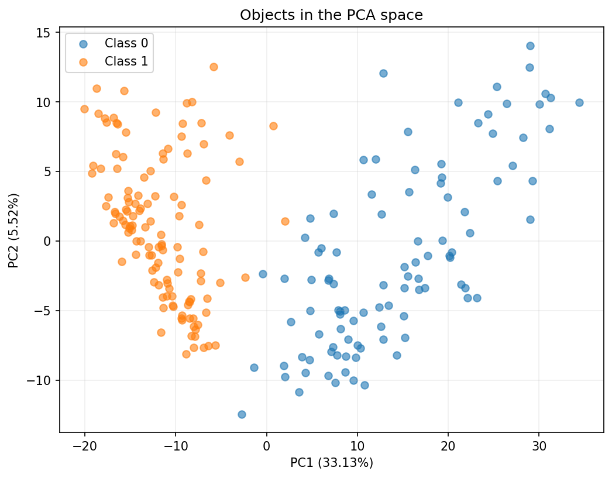
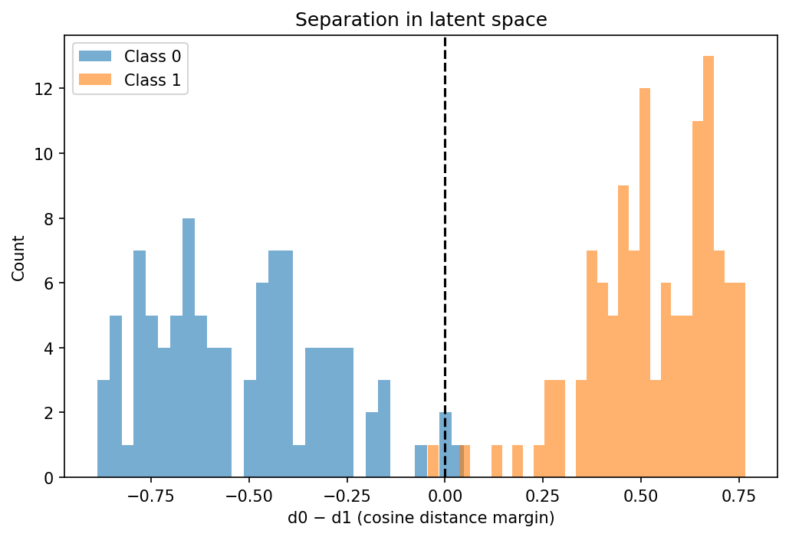
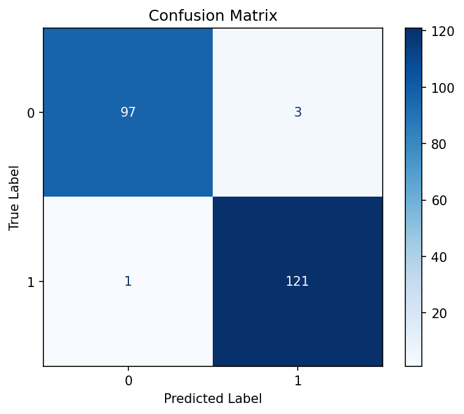
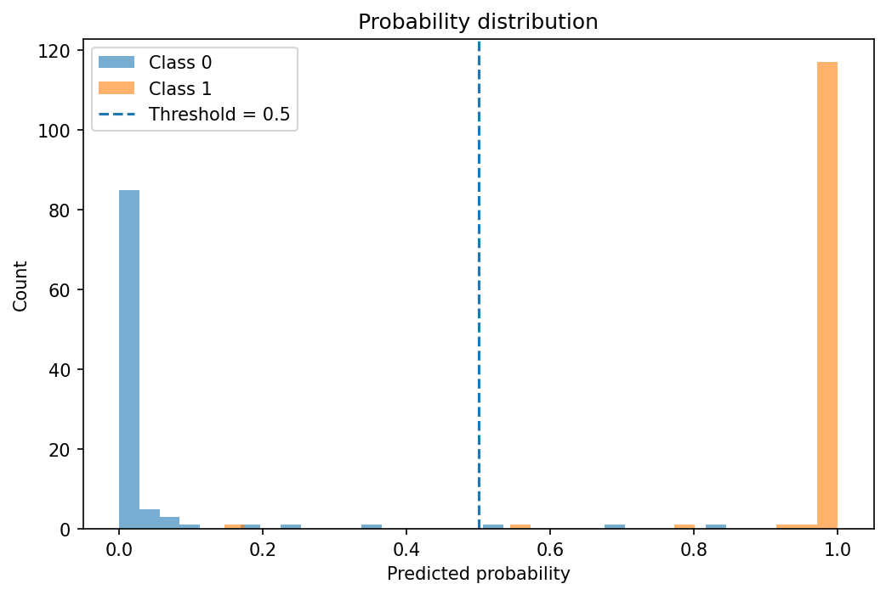

# AI or Not: детекция сгенерированных изображений (Swin V2)

Решение соревнования Kaggle [generated-or-not](https://www.kaggle.com/competitions/generated-or-not): бинарная классификация изображений «реальное фото / сгенерированное». Метрика — **LogLoss**.

| Метрика | Значение |
|---|---|
| Kaggle private LogLoss | **0.03275** |
| Kaggle public LogLoss | 0.06047 |
| LogLoss на val (222 изображения) | 0.0383 (с температурной калибровкой 0.0379) |
| Accuracy на val | 98.2% |

Одна модель, без ансамбля, без псевдоразметки и без метаданных файлов.

## Главная находка: утечка через формат и размер

В обучающих данных класс почти полностью определяется параметрами файла, а не содержимым:

| | Класс 0 (реальные) | Класс 1 (сгенерированные) |
|---|---|---|
| Расширение | только `.jpg` (667) | только `.png` (641) и `.jpeg` (171) |
| Размер (медиана / максимум) | 500×375 / 1000×750 | 928×752 / 2048×1536 |

Модель с `Resize((512, 512))` легко учится на этом «ярлыке»: растягивание маленькой картинки и сжатие большой оставляют разные следы интерполяции. Поэтому в этом ноутбуке:

- **нет `Resize`**: обучение на случайных кропах 384×384 в нативном разрешении (мелкие картинки дополняются отражением);
- **все** обучающие изображения пережимаются в JPEG со случайным качеством 70–100, чтобы формат файла не выдавал класс;
- для val и test используется отдельный детерминированный `eval_transform` (отражающий паддинг + центральный кроп), а паддинг в train и eval одинаковый.

## Пайплайн

**Данные.** Соревновательный датасет плюс собственные изображения, сгенерированные Stable Diffusion. Всего 1479 изображений (`train.csv`), стратифицированный сплит 85/15: 1257 train, 222 val. Test — 506 изображений.

**Модель.** `torchvision.models.swin_v2_t` (веса `IMAGENET1K_V1`) с новой головой `Linear(768→256) → ReLU → Dropout(0.25) → Linear(256→1)`, функция потерь `BCEWithLogitsLoss`.

**Обучение.**
- AdamW (`amsgrad`), `lr=1.5e-5` для backbone и ×10 для головы, `weight_decay=1e-3`;
- `ReduceLROnPlateau` (factor 0.3, patience 2) и early stopping (patience 6) по val-loss;
- batch 32, кроп 384, лучшая эпоха — 4-я.

**Аугментации (train).** `RandomCrop(384, reflect)` → JPEG (q 70–100) → горизонтальный и вертикальный флип.

## Анализ латентного пространства

Признаки backbone (после `avgpool`) на val: косинусное расстояние между центроидами классов **0.77**, accuracy по ближайшему центроиду **98.2%** (как у модели). Все четыре «чужих» объекта лежат на границе (|margin| < 0.05). Это значит, что оставшиеся ошибки определяются качеством признаков и данных, а не классификатором сверху.

  
  

Слева: проекция признаков val на две первые главные компоненты. Справа: разность косинусных расстояний до центроидов классов.

Калибровка в порядке: оптимальная температура 0.90 незначительно снижает LogLoss.

  
  

## Трудные случаи

Основной вклад в LogLoss вносят единичные картинки: небольшие сгенерированные изображения низкого разрешения (≈200×436) и реальные фото с сильным боке (спорт, портреты). Три худшие картинки давали около 60% всего лосса.

## Запуск

Ноутбук рассчитан на Kaggle (GPU):

1. Подключите датасет `vasilijkrukovskij/ai-or-not5` (`kaggle datasets download -d vasilijkrukovskij/ai-or-not5`).
2. Запустите `transformer.ipynb` целиком. Эпоха занимает около 1.5 минуты, обучение около 15 минут.
3. Предсказания сохраняются в `/kaggle/working/submission.csv`, лучшие веса — в `/kaggle/working/best_model.pth`.

Пути к данным заданы в начале ноутбука (`DATA_DIR`, `TRAIN_CSV`, `TEST_CSV`).

## Ограничения

- Val маленький (222), метрика на нём шумная, а лучшая эпоха выбрана по этому же val, поэтому оценка слегка оптимистична. Разница между public и private (0.060 против 0.033) показывает, насколько метрика зависит от нескольких картинок.
- Результат воспроизводится с точностью до шума: сид зафиксирован, но случайные кропы и JPEG в воркерах `DataLoader` не привязаны к нему.
- Одна модель и один сид.

## Что можно улучшить

- Ансамбль из нескольких моделей или сидов и усреднение логитов.
- 5-fold кросс-валидация и анализ OOF-ошибок, чистка меток.
- Больше разнообразных генераторов и "трудных" реальных фото (боке, спорт, портреты) в обучающей выборке.
- Усреднение предсказаний по нескольким кропам на инференсе.